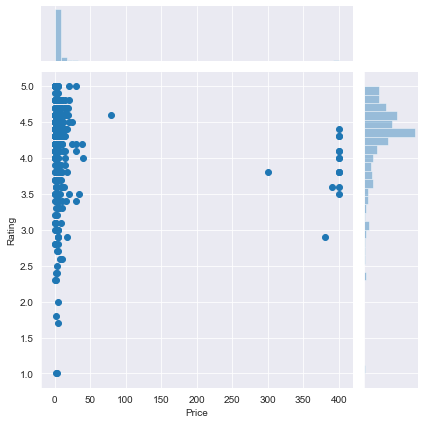

# Datacamp - Google Play Store App Review
## Aim
From given dataset analyse the types of android app, their prices, category and sentiment analysis

## Dataset
* `apps.csv`: contains all the details of the applications on Google Play. There are 13 features that describe a given app.

* `user_reviews.csv`: contains 100 reviews for each app, most helpful first. The text in each review has been pre-processed and attributed with three new features: Sentiment (Positive, Negative or Neutral), Sentiment Polarity and Sentiment Subjectivity.

The required files can be found [here.](dataset/)

## Solution
[Python Notebook (.ipynb)](notebook.ipynb)

## Summary
* Size vs Rating distribution

    

    * Percentage of low size apps with high rating(~4.5) is higher

* Price vs Rating distribution

    

* Price (under 100$) vs Category distribution

    

    * All the listed category have 'Paid' apps, as well as 'Free' apps.

* Comparison of Sentiments for Paid vs Free App

    

    * Free apps have larger negative sentiment response.

## Conclusion

* Paid apps that provide good content have better sentiment rating, but the overall download market is little bit inclined towards 'Free' applications.

