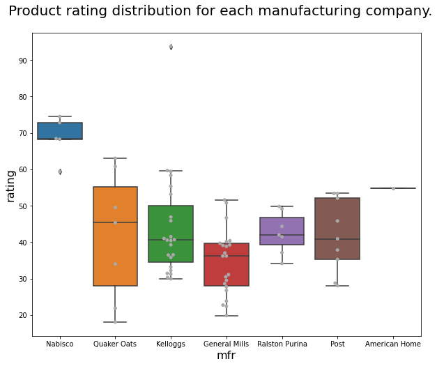
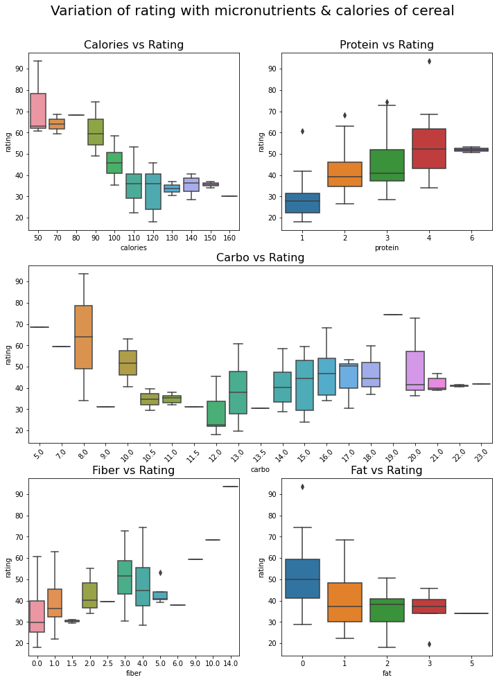
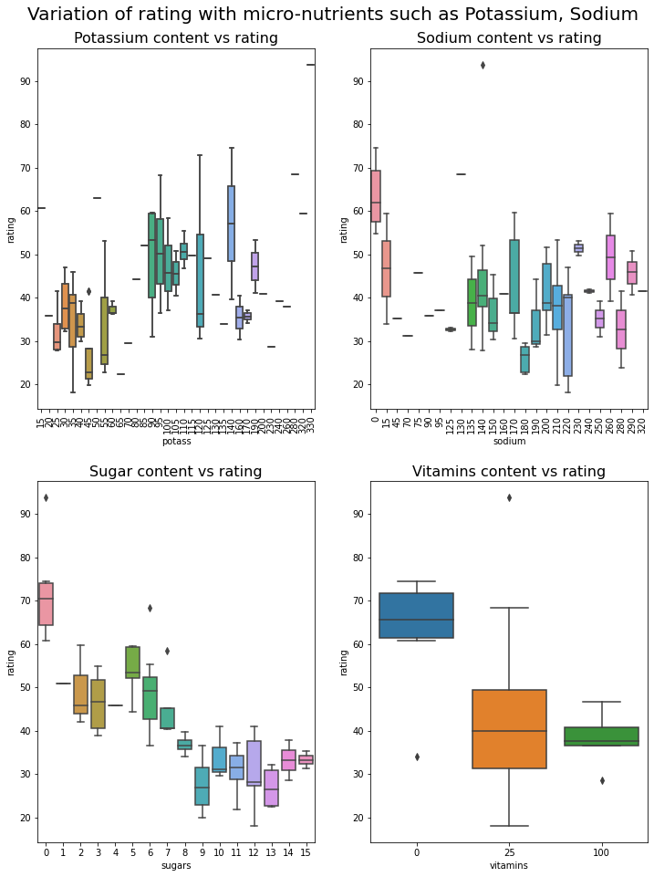
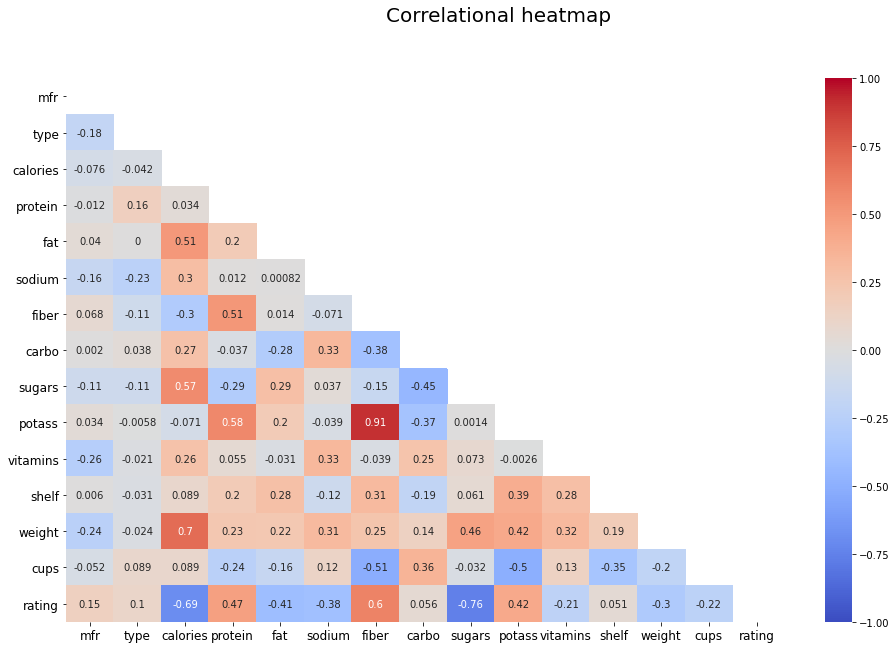
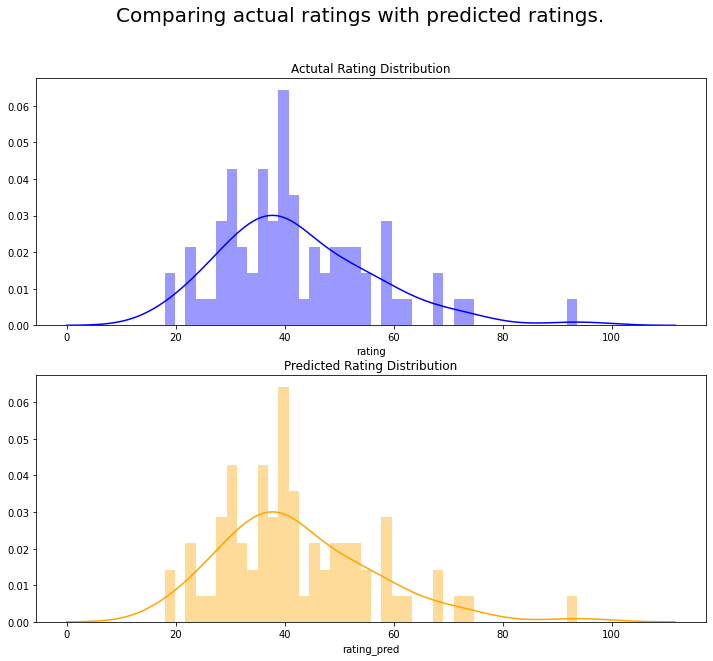

# Cereal EDA & Modelling
## Aim
The aim is to create a linear regression model that predicts the rating of cereals using the variables/inputs in the dataset.

## Dataset
The dataset can be found in [dataset](dataset) folder.

The data contains the following columns :
* name, mfr, type - name & manufacturer name 
* macronutrients content - calories, protein, fat, fiber contents
* micronutrients content - sodium, sugars, potassium, vitamins.
* other details - shelf life, cup size and weight.

## Solution
The solution is in [.ipynb report](cereal_eda_model.ipynb) or on [Colab link](https://colab.research.google.com/drive/1v3ZEHwMKktnWYEUsn_e8BOuJ2jzJco7a?usp=sharing)

## Summary
* Rating distribution for each manufacturer.
    
    * Nabisco has the best performing products while General Mills are the worst.

* Variation of rating with macronutrients such as calories, protein, carbs, fat, fiber
    
    * Increase in calories, reduces the rating i.e. more people prefer cereal with low calories. People prefer cereals with higher amount of protein, and low amount of fat & carbs.
    * Increase in fiber, increases the rating.

* Variation rating with micronutrients such as potassium, sodium, sugar & vitamins.
    
    * Rating decreases with increase in sugar content, while increase in potassium content increases the rating.

* Correlational heatmap of all variables with ratings.
    

    * The following factors influence rating of any cereal, either positively or negatively.

        |name | positive or negative?|
        |---- | --------- |
        |calories |-ve |
        |protein | +ve |
        |fat | -ve |
        |sodium | -ve |
        |fiber | +ve |
        |sugars | -ve |
        |potassium | +ve |

## Model
* Linear regression model built using scikit-learn.
* Following are the parameters.
    |Parameter | Value |
    |------ |------ |
    |R square (R^2) | 0.9999 |
* Comparison
    
    * The generated model is a close fit.