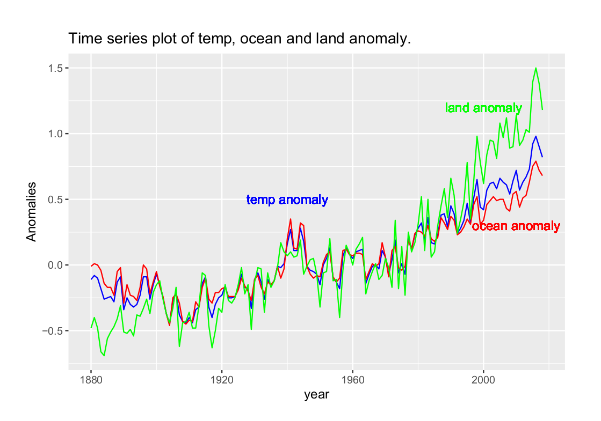
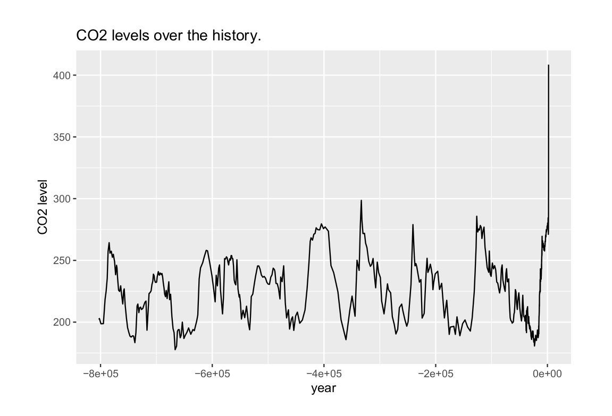

# Climate change datasets in R
(Part of edx study)

## Aim
To draw quick inferences from dslabs dataset: 
* historic_co2
* temp_carbon
* greenhouse_gases

## Dataset

Use the "dslabs" library for the following datasets.

1. `historic_co2` - provides level of co2 for as old as 800000 years old.
2. `temp_carbon` - provides temperature anomaly for land & ocean.
3. `greenhouse_gases` - provides level of greenhouse gases(co2, ch4, n20) for previous years.

## Solution
A pdf report, developed in R, knitted in Rstudio can be found [here.](exercise.pdf)

## Summary
* Time series of average temperature, ocean temp & land temp anomaly.

    

    * For the last 50 years, there is a quick increase in temp anomaly, with land and ocean rising rapidly.

* Levels of greenhouse gases across years.

    

    * The vertical line represent year 1850, which mark the assumed beginning of industrial revolution, and use of fossil fuels such as oil, gas and coal.
    * Since 1850, the greenhouse gases concentration has almost doubled.

* Carbon emissions in metric ton

    

    * Manmade carbon emissions have gone from almost 0 in 1850 to 10000 metric ton per year.

* Co2 level dating back 800000 years.

    

    * Historic data measured using ice cores show ups & downs in co2 level throughout the history.
    * However, recent human activity has spiked its increase in almost exponential manner.