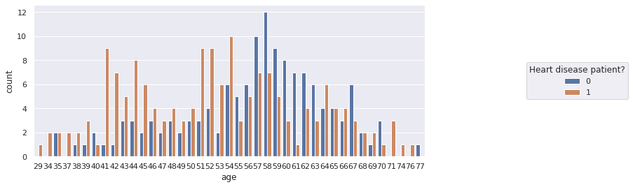
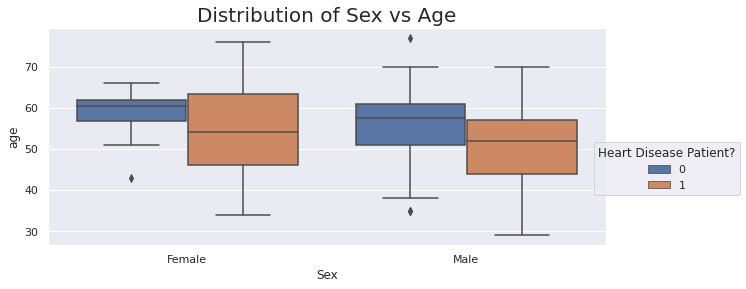
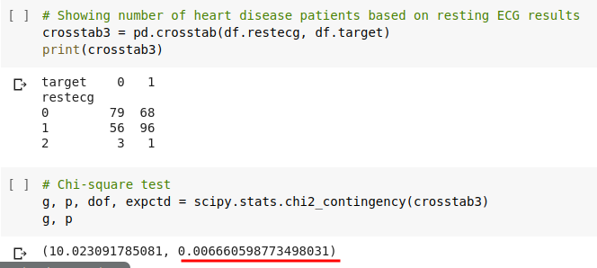

# # Heart Disease EDA
## Aim
From the given dataset analyse the patterns of variable that are indicative of having heart problem

## Dataset
* heart.csv

The required files can be found [here.](dataset/)

* Description
    * The datasets contains factors that might be helpful of indicating presence of heart disease.
    * The facotrs are: sex, age, bloodpressure, cholesterol level, bloodsugar, chest pains, exercise induced pains etc.

## Solution
[Python Notebook (.ipynb)](eda_heart_disease.ipynb) + [Colab Link](https://colab.research.google.com/drive/1KM3q39XjMsFV7Z3o4ce1dfw1ScgvAMGp)

## Summary
* Age vs Heart disease

    * Heart disease patient - **0 = Heart disease present**, **1 = Heart disease absent**

    * Chances of heart disease increase with age.

* Sex vs Heart disease

    * Males are more likely to be a victim of heart disease than females. Also males of ages as early as 40 years can be target of a heart disease

* Chest pain vs Heart disease
    |target  |  0 |  1|
    | ---- | -- | -- |
    |cp |  |  |             
    |0|       104|  39|
    |1       |  9  |41|
    |2   |     18 | 69
    |3   |      7| 16
    `chi^2 = (81.68642755194445, p-value = 1.3343043373050064e-17)`
    * Chest pain are good indication of heart problem

* ECG vs Heart disease

p-value of 0.0066 indicate that ECG values is related to identification heart problem

## Conclusion
* Sex, Age, Chest Pains, ECG are good indicator of underlying heart problem, while
* Cholesterol, Blood pressure, Blood sugar, do not draw a confirmed relation with heart problems.