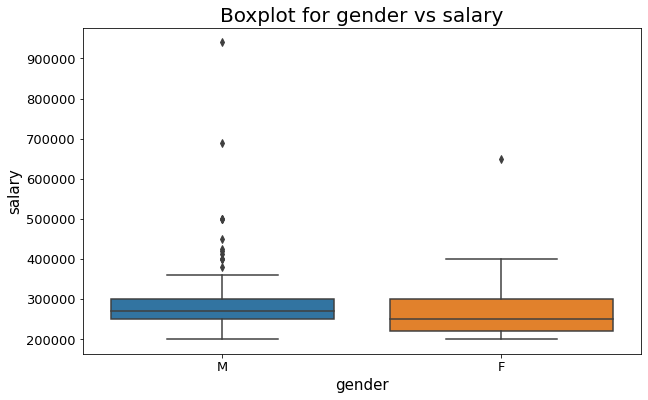
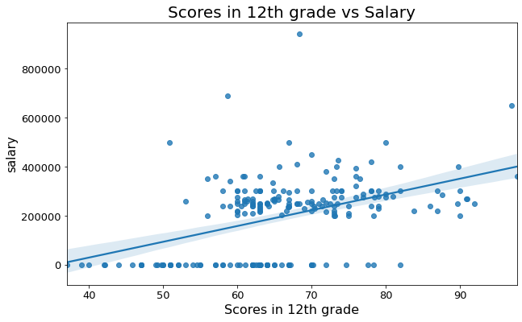
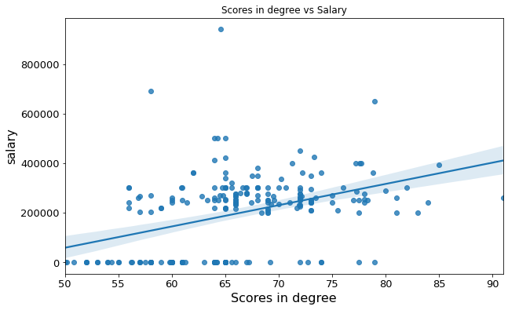
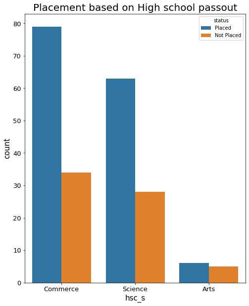
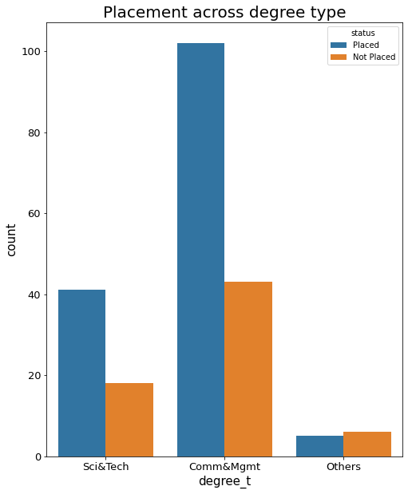
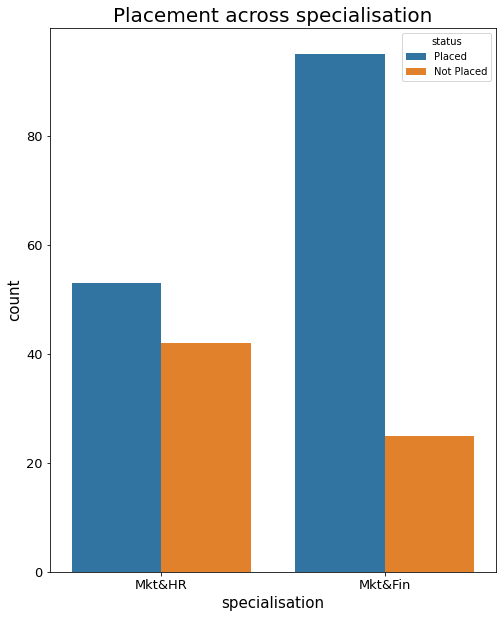
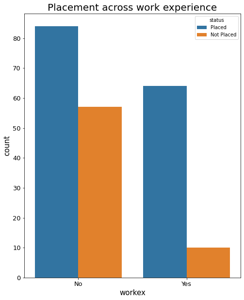
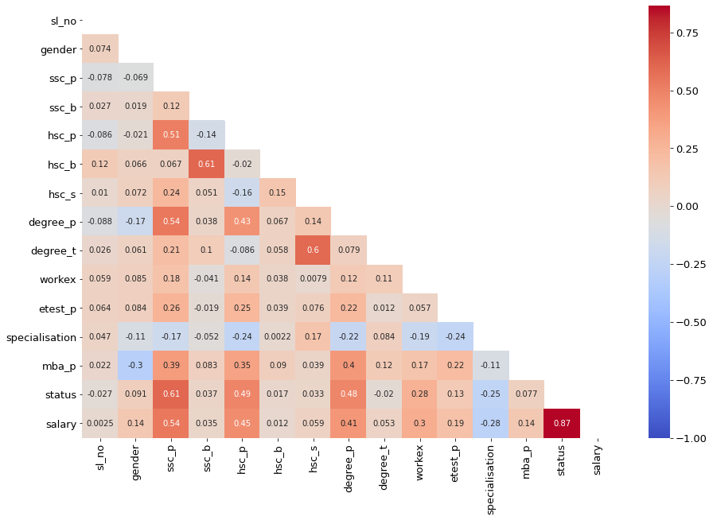

# Campus Recruitment EDA
## Aim
From the given dataset, figure out pattern that has the best probability of getting placed during job recruitment

## Dataset
* placement.csv

The data can be found here [placement.csv](dataset/placement.csv)

* Description:
    * Dataset contains `gender`, marks obtained in `10th`, `12th`, `degree` and `specialisation`.
    * Also contains the `major subjects` of the students
    * Has information on the placement status and `salary`.

## Solution
[Python Notebook (.ipynb)](campus_recruitment.ipynb) + [Colab Link](https://colab.research.google.com/drive/1HtZCX0T6sKO3k9_cCYriEcenB1SLDlnS?usp=sharing)

## Summary
* Gender vs Salary

* Scores in 12th grade vs salary

* Scores in degree vs salary

* Students placed based on the major in high school

* Students placed based on the major in degree

* Students placed based on specialisation

* Students placed based on Work Experience

* Correlational heatmap after converting all categorical factors to numerical using `Label Encoder`.

## Analysis
* Males salary is slightly higher than females.
* Improved scores in school and degree, improves the chance of getting placed and better salary.
* Students in field of `Commerce`, `Management`, and `Finance` have the highest probability of getting placed.

* Students with previous work experience have good chance of getting new job.

## Conclusion
* The following table summarises factors affecting the campus recruitment

    |Factor | Affect/Correlation |
    | ---- | ----- |
    | 10th scores, 12th scores, degree scores | Positive |
    | `Commerce`, `Finance` as field of study  | Positive |
    | Previous `Work Experience` | Positive |

