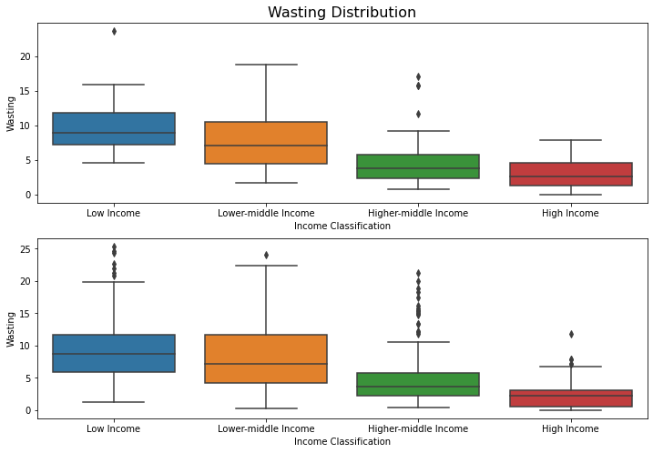
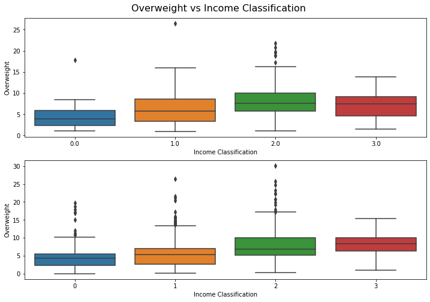
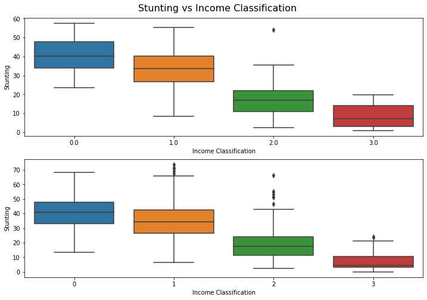
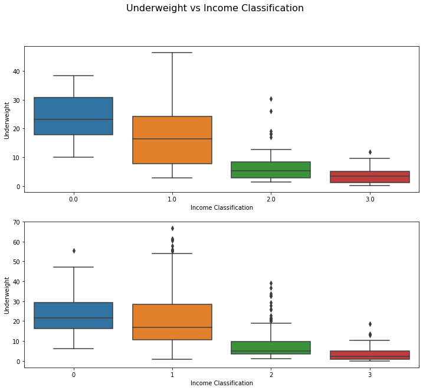
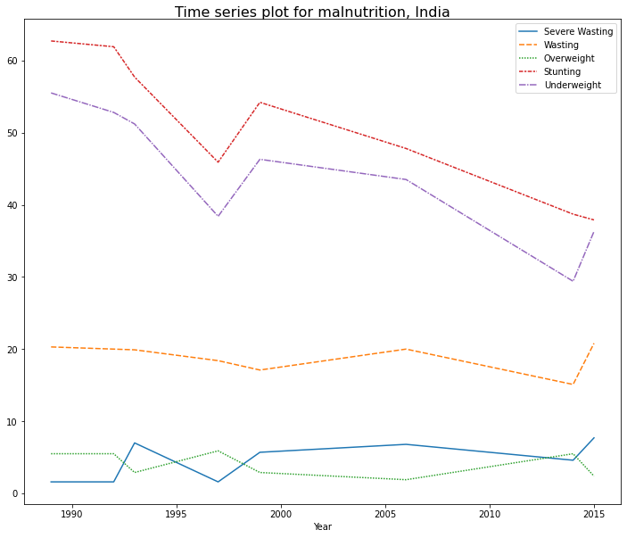
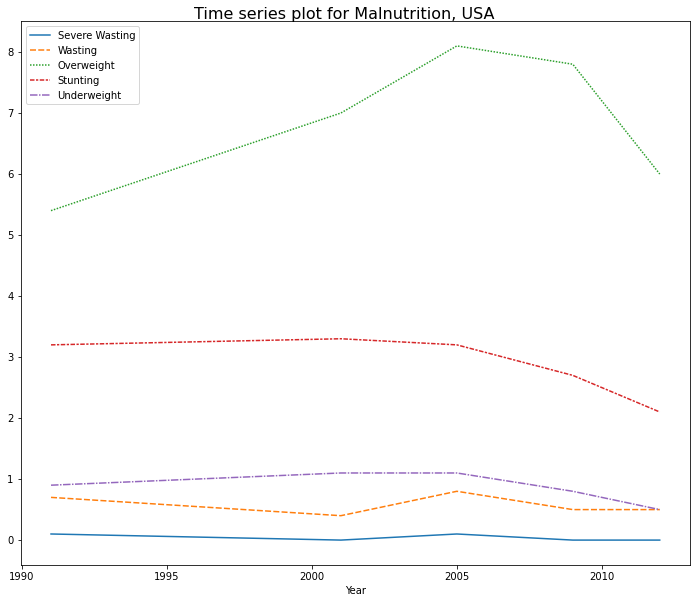
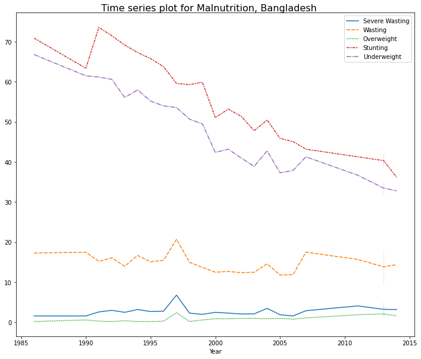

# Malnutrition Dataset
## Aim 
To perform EDA of malnutrition dataset, containing information on Overweight, Underweight, Stunting, Wasting etc. for all countries across many years.

## Dataset
The dataset can be found in the [dataset](dataset) folder.

The datasets contain following information:
* Country, year, NOC code, Income Classification.
* Types of malnutrition:
    * Stunting, Wasting, Severe Wasting, Underweight, Overweight.

## Solution
The solution is in [.ipynb reprort](malnutrition.ipynb) & [Google Colab link](https://colab.research.google.com/drive/1btyIUOWmDXQVkVkb7dlq2u5HyEsAhDqd?usp=sharing)

## Summary
* Wasting (rapid deterioration in nutrition for children) is higher in Low Income Countries (Economically Poor)
    

* Overweight vs Income Classification of countries
    
    * Overweight percentage is higher for High Income Countries (Economically Rich)

* Stunting (Growth failure over long period of time) vs Income Classification
    
    * Stunting, similar to Wasting, is higher for economically poor countries.

* Underweight (Lower weight than average weight for particular height)
    
    * Underweight is higher among countries with low income.

* Trend for India
    
    Graph shows that forms of undernutrition (Wasting, Stunting, Underweight) are decreasing in India.
* Trend for US
    
    * Overweight is a big issue in United States

* Trend for Bangladesh
    
    * As the economy of countries improve undernutrition among children & adolescent is also improving.

## Conclusion
* Wasting, Stunting, Severe Wasting are parameters that indicate undernutrition. For economically poor countries, the scarcity of money to buy nutritional food is low, as a result, undernutrition is more prevalent in Low Income Countries.
* Obesity and Overweight are more prevalent in rich countries, due to quick and easy access to junk and fast food.
* Undernutrition and Obesity both can be damaging to proper growth of a children, and therefore special focus must be kept on eating food with good nutritional value.
