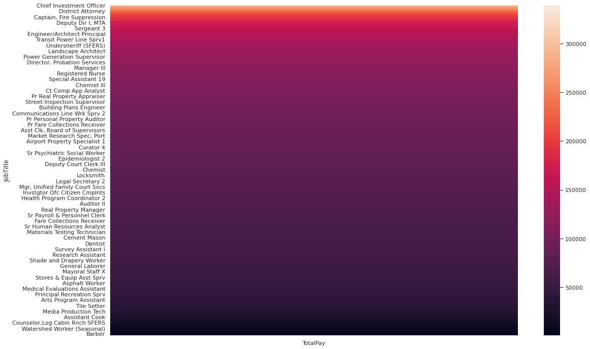
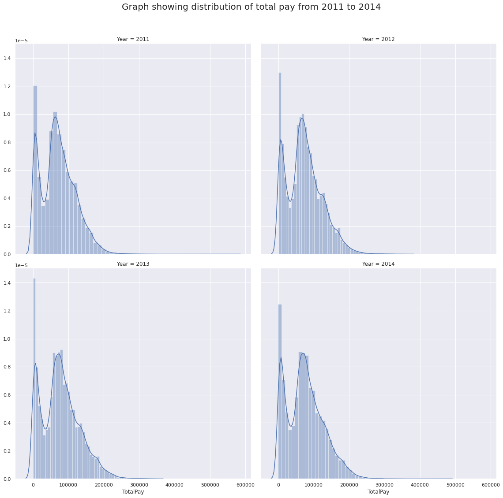
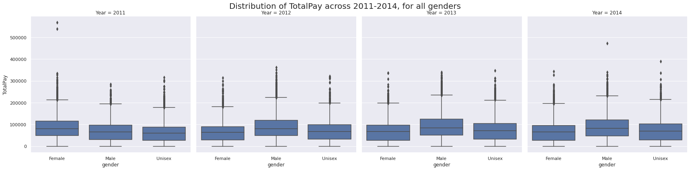
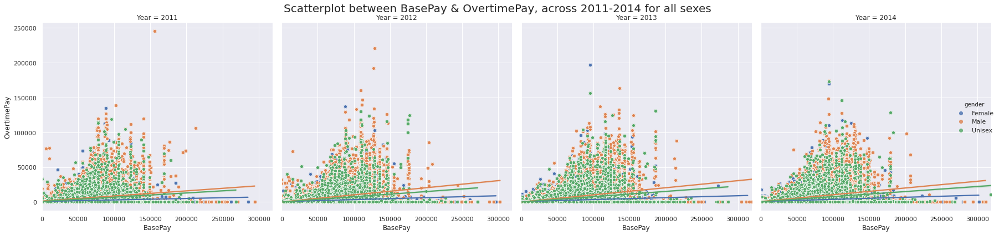

# SF salary analysis
## Aim 
From the given dataset, analyse the pattern of salary across job types, genders & year.

## Dataset
* .sqlite3 
* gender.csv

The required files can be found [here](dataset/)

## Solution
[Python Notebook (.ipynb)](SF_salary_analysis.ipynb) + [Colab Link](https://colab.research.google.com/drive/1YHC4KWzCLycY7hdGGrHF41Bruv2QwQ6z)

## Summary
* The heatmap describes the relation of Job type with average Salary for that job.

* Top paying jobs are.

    |JobTitle	  |Average TotalPay |
    |------|------|
    |GENERAL MANAGER-METROPOLITAN TRANSIT AUTHORITY	| 399211.275000 |
    | Chief Investment Officer |	339653.700000 |
    | Chief of Police	| 329183.646667| 
    | Chief, Fire Department |	325971.683333|
    | DEPUTY DIRECTOR OF INVESTMENTS |	307899.460000 | 

* Salary distribution across years 2011-2014.

    * **Unemployement increased in 2013 & 2014.**

* Salary distribution based on gender.

    * **Average salary for females was higher in 2011, but since then the average salary for males is higher than females.**
    
* Overtime pay vs Salary based on gender.

    * **With increased basepay, the overtime pay increased, but the increase was more favorable to males as compared to females.**

## Conclusion
* Males enjoy a better salary in employement when compared with females.
* Full time employees enjoy more benefits such as Overtime pay, while part time employees have limited benefits.