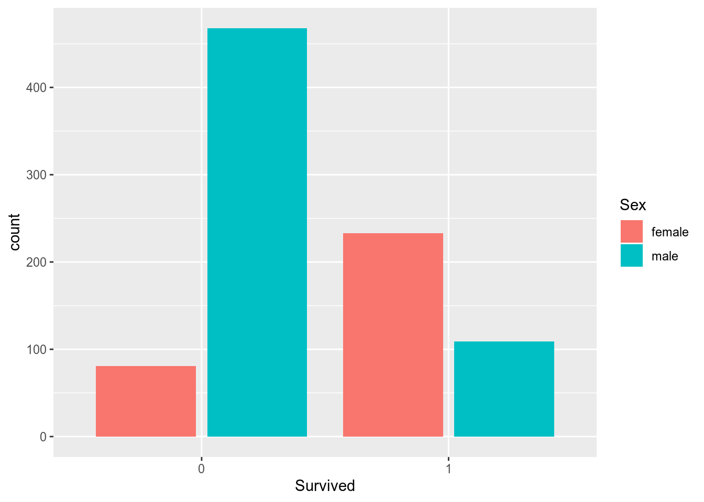
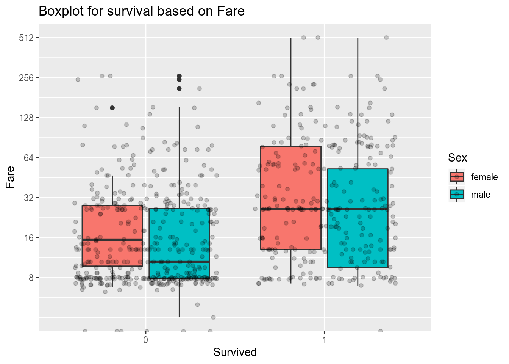
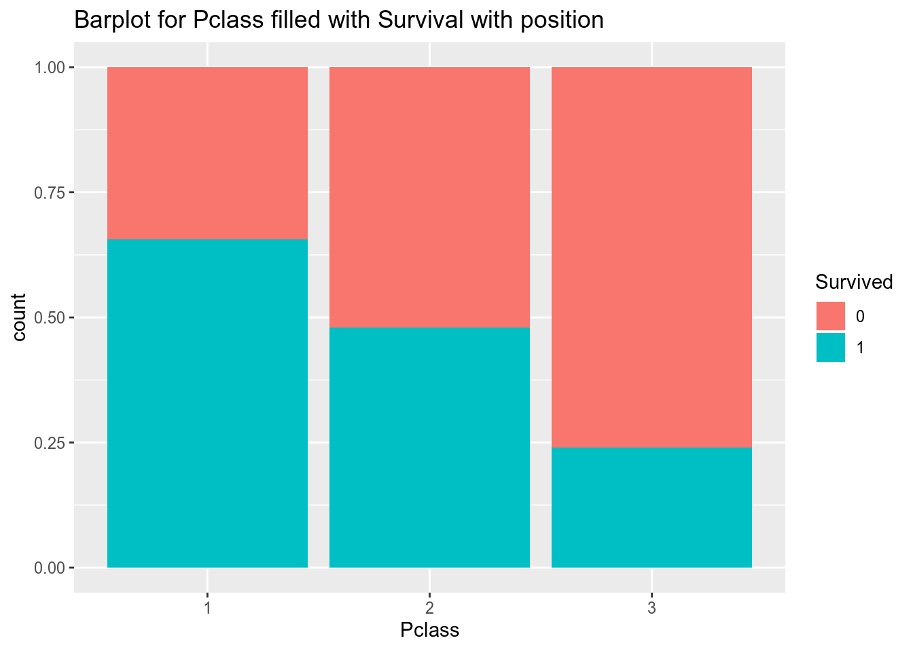
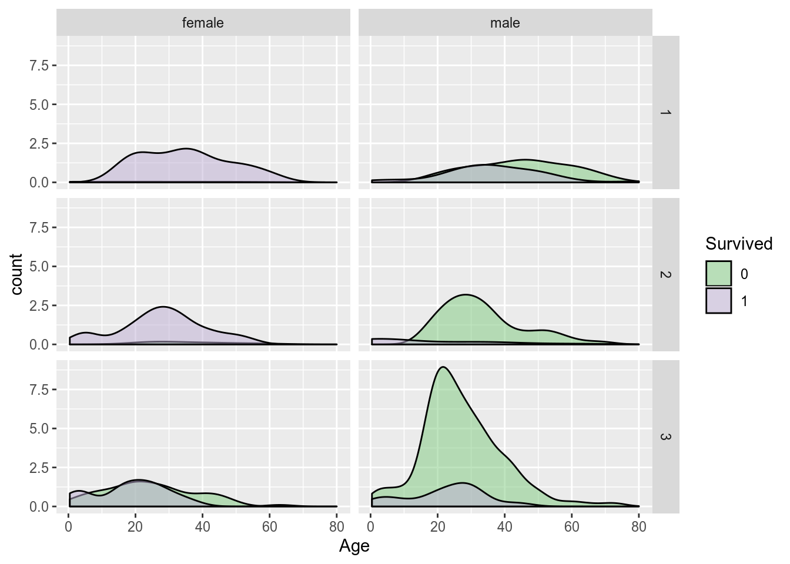

# Titanic survival Analysis
(Popular on Kaggle)

## Aim
From the dataset draw inferences that help map the survival probability of any passenger on Titanic.

## Dataset
Can be easily found on Kaggle

## Solution
A pdf report, knitted in R, can be found [here](titanic_survival.pdf)

## Summary

* Survival count based on Sex

    * More proportion of females survived the incident.

* Survival based on Fare

    * Passenger who paid higher fare had more chances of survival, and this can be seen in the next graph as well, since higher fare means ticket for first class or second class.
* Survival based on Passenger Class

    * First class had the most survival, while third class had the most fatality.

* Density plot for age, faceted by passenger class & sex.

    * 3rd class males were the biggest group of passenger on Titanic, and majority of them did not survive the sinking.
    * Almost all the males of 2nd class lost their lives, except for children.