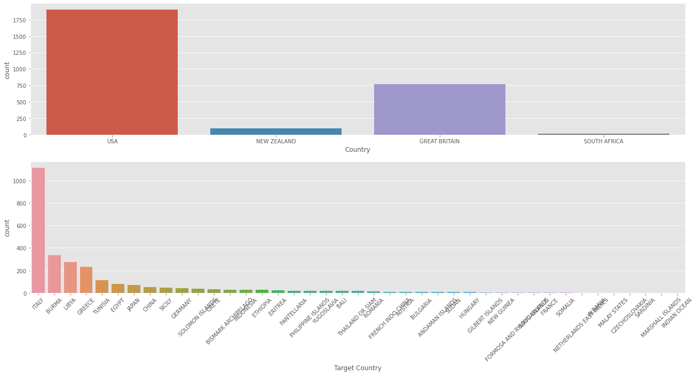
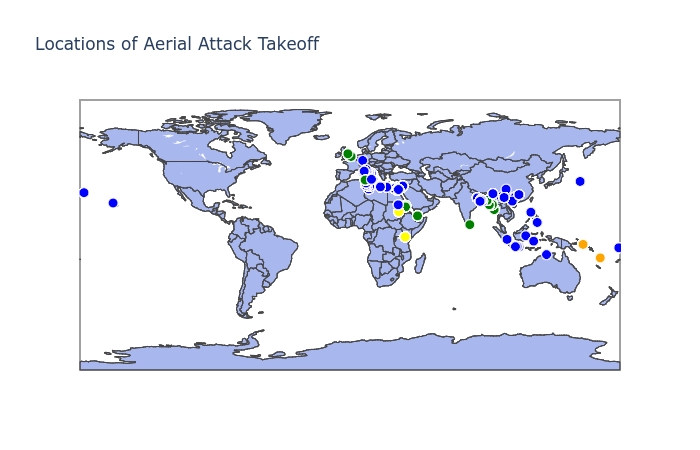
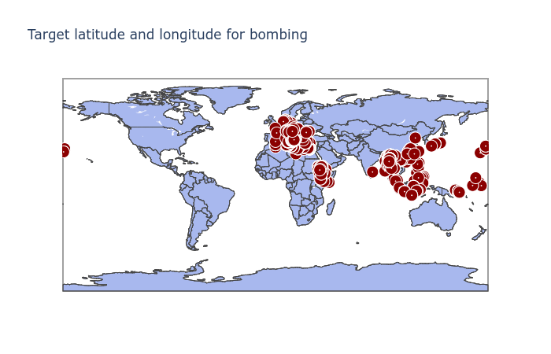
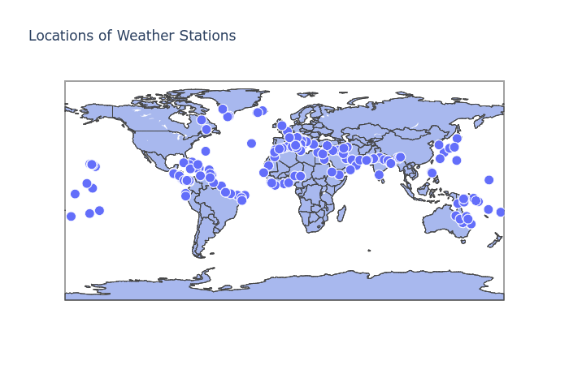
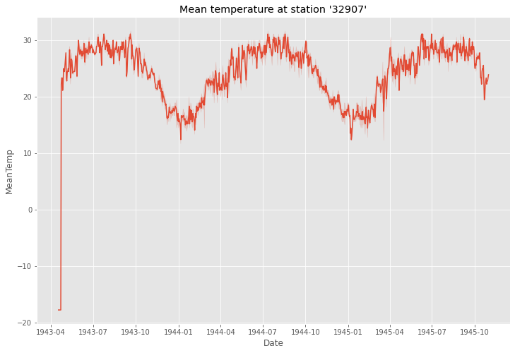

# World War 2 Weather & Bombing
## Aim
To perform EDA & Time Series Analysis (*unfinished*) to predict bombing on a particular Target.

## Dataset
The weather dataset can be found in the [dataset](dataset) folder + aerial bombing dataset can be foung on [Kaggle](https://www.kaggle.com/usaf/world-war-ii)

The datasets contain following information:
* weather_stations.csv - Details of all the weather stations across the globe used in World War 2.
* weather_summary.csv - Weather reports such as Max, Min Temp, Percipitation, Snowfall, Windspeed etc. for all weather stations.
* operations.csv - Details of all the aerial bombing operations during the war.

## Solution
The solution is in [.ipynb report](https://www.kaggle.com/prashambhuta/ww2-weather-eda-time-series-prediction-learnin)

## Summary
* Major bombing was done by USA & Britain, while the Target Country were Italy, Burma, Libya.
    

* The geomap depicts the major take off locations for bombing.
    

* The geomap points to the longitude and latitude of target locations.
    

* The geomap points to the weather station locations.
    

* Lets check out the Temperature pattern of a particular weather station '32907: INDIA'. This weather station was used to monitor the weather at target location of BURMA.
    

## Conclusion
* The aim is to learn time series analysis and predict future bombings, based on the weather pattern. However, I got stuck trying to visualise the temperatures on the bombing dates.

* **Will like to give it a try again after few weeks.**