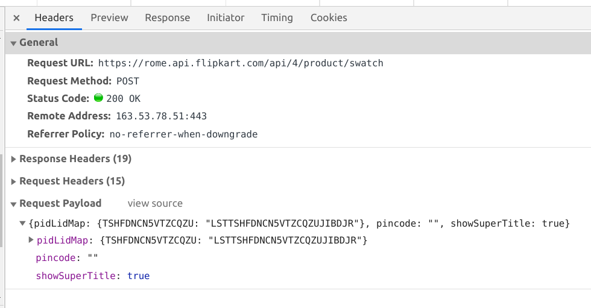
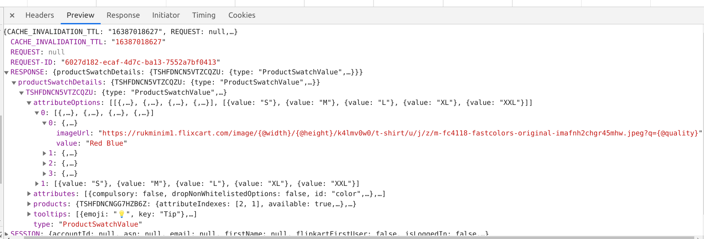

# Scraping flipkart product image
## Intro
The aim is to scrap the default thumbnaill image of each of the 40 products on the listings page.

## Working (Request)
The images, images link are generated based on 'POST' AJAX request, the format request is:

```js
{
    "pidLidMap": {
        product_id: listing_id
    }
    "pincode":"",
    "showSuperTitle":true
}
```

A sample request is as below, where:
    
`product_id = "TSHFDNCN5VTZCQZU"`

`listing_id = "LSTTSHFDNCN5VTZCQZUJIBDJR"`

```js
{
    "pidLidMap": {
        "TSHFDNCN5VTZCQZU":"LSTTSHFDNCN5VTZCQZUJIBDJR"
    },
    "pincode":"",
    "showSuperTitle":true
}
```


## Response

A sample json response can be [found in the /dump folder.](../dump/response.json)

The image url can be found using the following structure.

```py
response.json['RESPONSE']['productSwatchDetails'][product_id]['attributeOptions'][0][0]['imageUrl']

# where product_id = "TSHFDNCN5VTZCQZU"
```



## Solution

The idea is to scrap the product_id & listing_id, and use that value to send POST request and extract the image link from the response.

* The `product_id` and `listing_id` are scraped and stored in the .csv


## Problem/issue

The request method requires to emulate the browser, and so for that the `X-user-agent` is to be used in the header.

```
X-user-agent: Mozilla/5.0 (X11; Linux x86_64) AppleWebKit/537.36 (KHTML, like Gecko) Chrome/81.0.4044.138 Safari/537.36 FKUA/website/42/website/Desktop
```