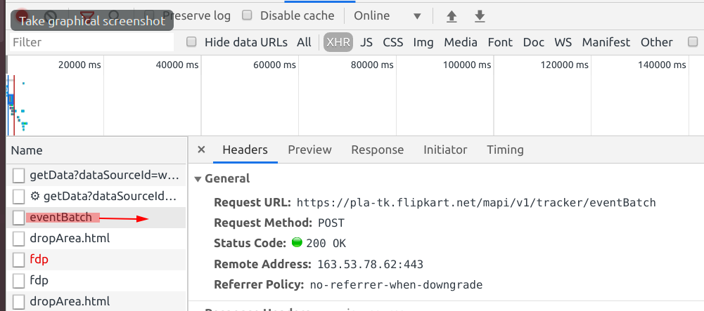

# Scraping flipkart items after 25 pages
## Background
* Flipkart only displays products upto 25 pages, after 25th page the response body is empty. i.e. there are no products displayed.

## Steps
* Go to this url -> https://www.flipkart.com/men/tshirts/pr?sid=2oq%2Cs9b%2Cj9y&otracker=nmenu_sub_Men_0_T-Shirts&page=1
* Change the  `&page=` to `25` 
* You will see the products successfully.
* Change the `&page=` to `26` or click on `NEXT` or click `26` page number
* You will either receive an error, or the page will load with empty fields.

## Current Result
* You can use scrapy for pages `1 to 25`, which can give a maximum of 1000 products (40 per page).

## Expected Result
* Find a solution so that you can scrap more pages, atleast 100 pages per product.

## Technical Debt
* Though 25 pages is a good start, it will be much helpful to scrap more pages.

## Screenshot

* `eventBatch` request is only generated for page 25. Maybe this is of some importance.